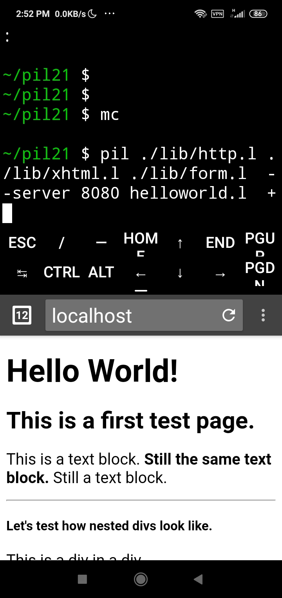
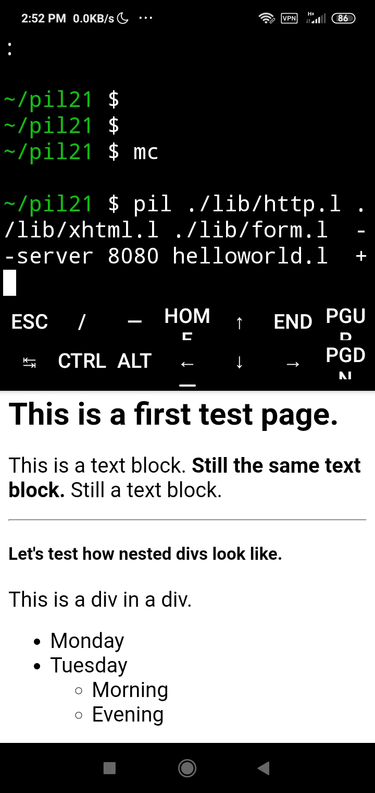
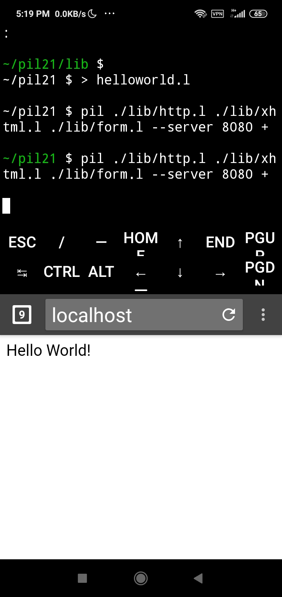

# PicoLisp Test Code

## 2022-07-10

- Code tested from [Intents and Java Interface blog](https://picolisp-explored.com/mobile-app-development-in-picolisp-vi-intents-and-the-java-interface)

```
android: (show CONTEXT)
{H@@@40000000000} ({H@@@1507316155} . "de.software_lab.pilbox.PicoLisp")
   GUI {H@@@630144062}
   Home "/data/user/0/de.software_lab.pilbox/files"
   Pid {H@@@27043500604}
   Port "8081"
   Proc {H@@@444600242}
   Pty {H@@@13263303414}
   Rfl {H@@@1405150463}
   Screen NIL
   Start "http://localhost:8081"
   StdIn {H@@@1503146360}
   StdOut {H@@@641111151}
   Terminal NIL
   Tty NIL
   Uuid "56bd7e3d-df83-435b-ae14-1b6d603253c8"
   Loaded T
-> {H@@@40000000000}
android: (show '{H@@@40000000000})
{H@@@40000000000} ({H@@@1507316155} . "de.software_lab.pilbox.PicoLisp")
   GUI {H@@@630144062}
   Home "/data/user/0/de.software_lab.pilbox/files"
   Pid {H@@@27043500604}
   Port "8081"
   Proc {H@@@444600242}
   Pty {H@@@13263303414}
   Rfl {H@@@1405150463}
   Screen NIL
   Start "http://localhost:8081"
   StdIn {H@@@1503146360}
   StdOut {H@@@641111151}
   Terminal NIL
   Tty NIL
   Uuid "56bd7e3d-df83-435b-ae14-1b6d603253c8"
   Loaded T
-> {H@@@40000000000}
android: (show (get CONTEXT 'GUI))
{H@@@630144062} ({H@@@533531374} . "de.software_lab.pilbox.PilBoxActivity")
   PilView {H@@@1060246617}
   Auto NIL
   Back NIL
   ClearHistory NIL
   Config {H@@@121102356}
   Ex NIL
   Exit NIL
   Fore NIL
   Home "/data/user/0/de.software_lab.pilbox/files/"
   Result NIL
   State NIL
   Url NIL
   Vcb NIL
   SRV {H@@@40000000000}
-> {H@@@630144062}
android: (show (get CONTEXT 'GUI 'Config))
{H@@@121102356} ({H@@@171503545} . "com.android.webview.chromium.ContentSettingsAdapter")
   a {H@@@1141516072}
   b {H@@@61460353}
-> {H@@@121102356}
android: (show (get CONTEXT 'GUI 'PilView))
{H@@@1060246617} ({H@@@142164215} . "android.webkit.WebView")
   mProvider {H@@@1015025102}
   mWebViewThread {H@@@764700765}
   RENDERER_PRIORITY_BOUND 1
   RENDERER_PRIORITY_IMPORTANT 2
   RENDERER_PRIORITY_WAIVED 0
   SCHEME_GEO "geo:0,0?q="
   SCHEME_MAILTO "mailto:"
   SCHEME_TEL "tel:"
   sEnforceThreadChecking T
-> {H@@@1060246617}

```


## 2022-07-03

- Understanding `view` function on PilBox app.

```
android: ( view '( a ( b c d) e f g ( h ( i (j (k l m n o p]
+-- a
|
+---+-- b
|   |
|   +-- c
|   |
|   +-- d
|
+-- e
|
+-- f
|
+-- g
|
+---+-- h
    |
    +---+-- i
        |
        +---+-- j
            |
            +---+-- k
                |
                +-- l
                |
                +-- m
                |
                +-- n
                |
                +-- o
                |
                +-- p
-> NIL

```
- Different combinations with `cons`. 

```
~ $ pil +
: (cons 2 3)
-> (2 . 3)
: (cons (2 3) (2 3))
-> ((2 3) 2 3)
: (cons 1 2 3 4)
-> (1 2 3 . 4)
: (cons (1 2) 3 4)
-> ((1 2) 3 . 4)
: (cons (1) (2) (3))
-> ((1) (2) 3)
: (cons 1 (cons 2 (cons 3)))
-> (1 2 3)
: (setq x (cons 2 3))
-> (2 . 3)
: (car x)
-> 2
: (cdr x)
-> 3
```

- Tinkering with `list` function. 
- Here `car` is first in list. 
- And `cdr` is rest in list. 

```
: (list 1 2 3)
-> (1 2 3)
: (list "a" "b" "c")
-> ("a" "b" "c")
: (car @)
-> "a"
: (cdr @)
!? (cdr @)
"a" -- List expected
: (cdr @@)
-> ("b" "c")
: (list 1 2 3)
-> (1 2 3)
: (car @)
-> 1
: (cdr @@)
-> (2 3)

```

- Symbol : Key - Property ([Source ref for example](http://xahlee.info/emacs/emacs/elisp_association_list.html))

```
: (setq x '((mary . 23) (john . 40) (henry . 30)))
-> ((mary . 23) (john . 40) (henry . 30))
: (car x)
-> (mary . 23)
: (cdr x)
-> ((john . 40) (henry . 30))

```
## 2022-06-14

[Code tried from HTML FIRST PAGE](https://picolisp-explored.com/web-application-programming-in-picolisp-adding-html-tags)





## 2022-06-13

```
~/pil21/lib $ pil +
: (load "xhtml.l")
-> (micro . PRG)
: (load "http.l")
-> http404
: (html 0 "Hello" NIL NIL "Hello World!")
HTTP/1.0 200 OK
Server: PicoLisp
Date: Mon, 13 Jun 2022 07:30:25 GMT
Cache-Control: max-age=0
Cache-Control: private, no-store, no-cache
Content-Type: text/html; charset=utf-8

<!DOCTYPE html>
<html lang="en">
<head>
<meta name="viewport" content="width=device-width"/>
<title>Hello</title>
</head>
<body>
Hello World!</body>
</html>
-> NIL
: (html 0 "Hello" NIL NIL "Hello World! How are you all?")
HTTP/1.0 200 OK
Server: PicoLisp
Date: Mon, 13 Jun 2022 08:22:47 GMT
Cache-Control: max-age=0
Cache-Control: private, no-store, no-cache
   (prin "<script type=\"text/javas   (pass prin)
   (prinl "</script>") )

(private) (Upd Ttl Css)

### XHTML output ###               (de html (Upd Ttl Css ATTR . Prg)
   (httpHead NIL Upd)
   (let ((Beg Html Head Body End) *
      (ht:Out *Chunked
         (micro Beg)                        (let LANG (or *Lang "en")
            (micro Html) )
         (micro Head
1/1 xhtml.l           1,151/940 16%
-> NIL
: (help 'println)
========================================
(println 'any ..) -> any
Prints all any arguments to the current output channel, followed by a newline.
If there is more than one argument, a space is printed between successive
arguments. See also print, printsp.

========================================
-> println
: (help 'print)
========================================
(print 'any ..) -> any
Prints all any arguments to the current output channel. If there is more than
one argument, a space is printed between successive arguments. No space or
newline is printed after the last item. See also println, printsp, sym and str

========================================
-> print
:
```
Starting PicoLisp Server: 

```
~/pil21/lib $
~/pil21 $ > helloworld.l

~/pil21 $ pil ./lib/http.l ./lib/xhtml.l ./lib/form.l --server 8080 + 
~/pil21 $ pil ./lib/http.l ./lib/xhtml.l ./lib/form.l --server 8080 + 
~/pil21 $
```


## 2022-06-11

```
$ pil family.l +
: *Dbs
-> (0 2 3 3)
: (symbols '(family svg pico))
-> (pico)
family:
```
## 