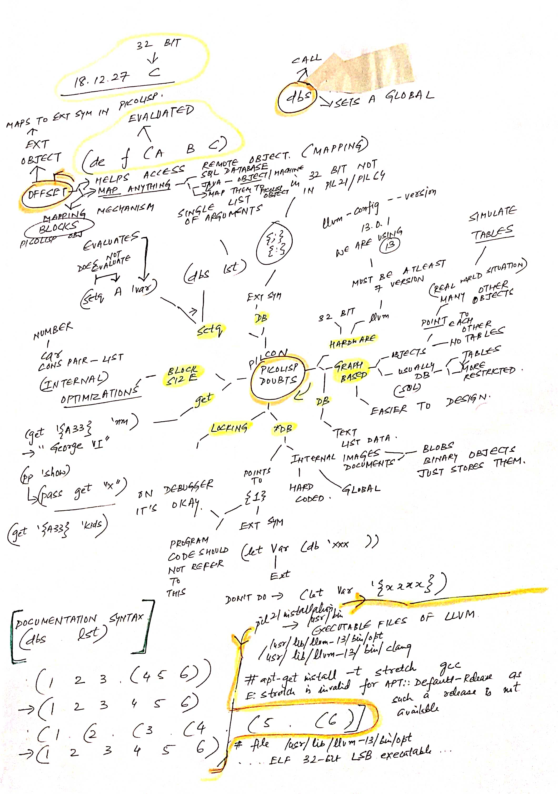
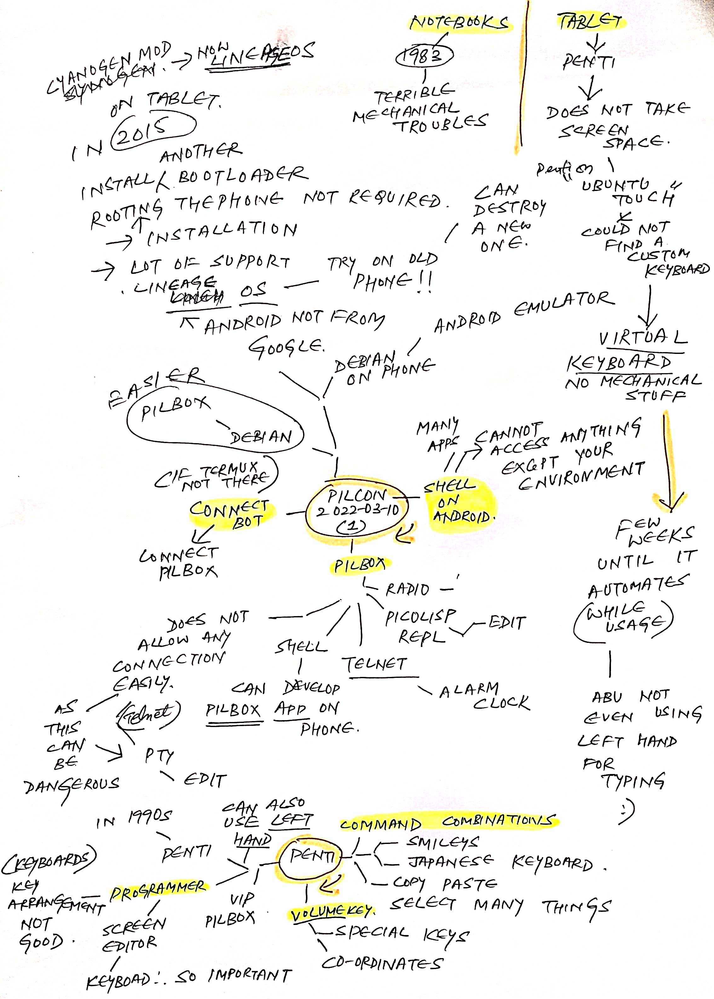
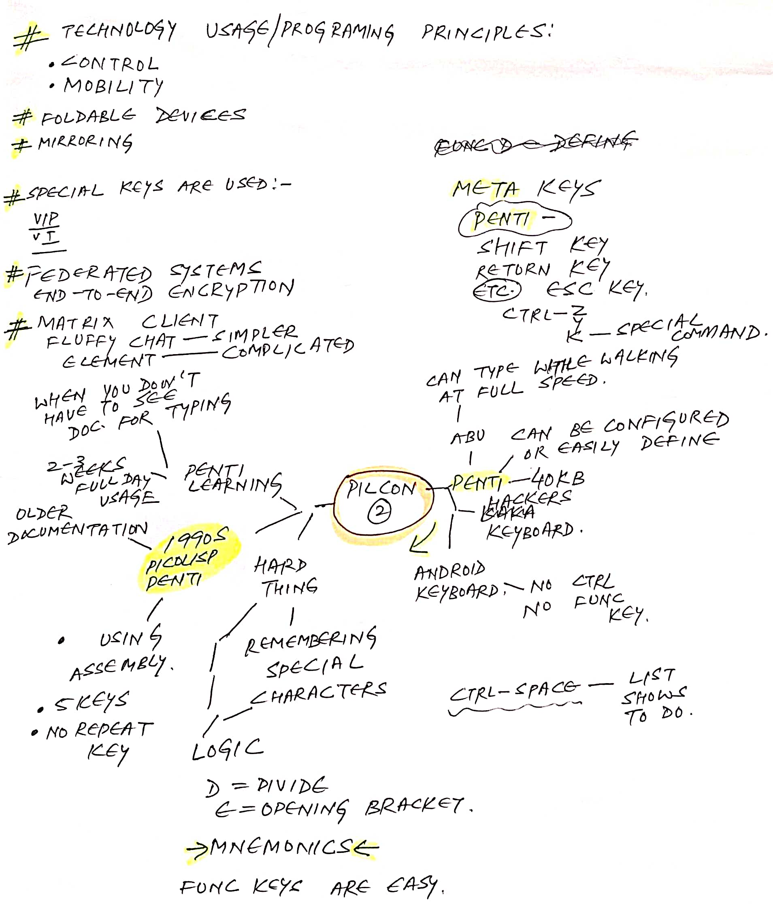
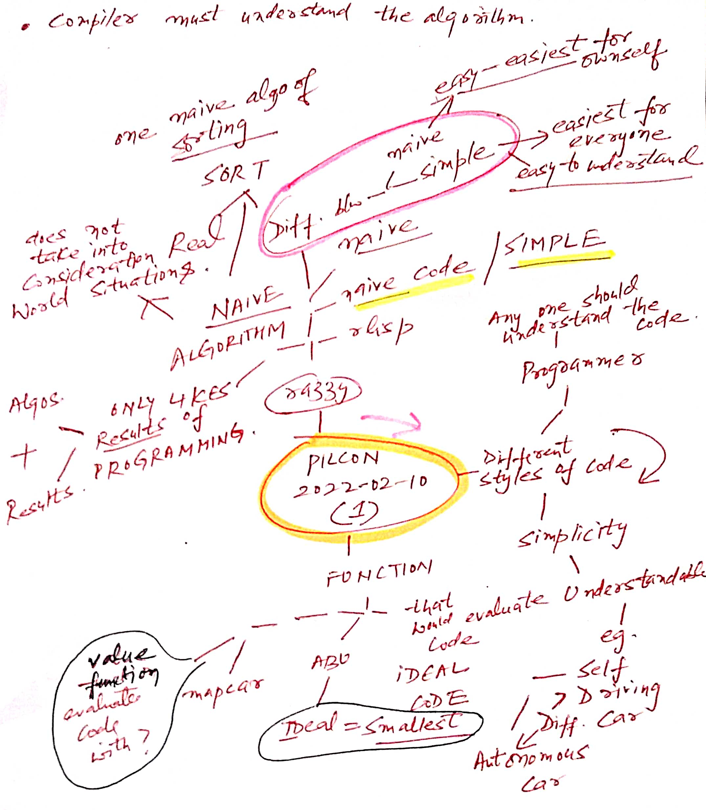
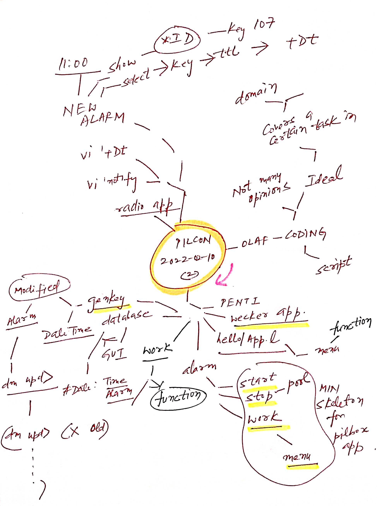
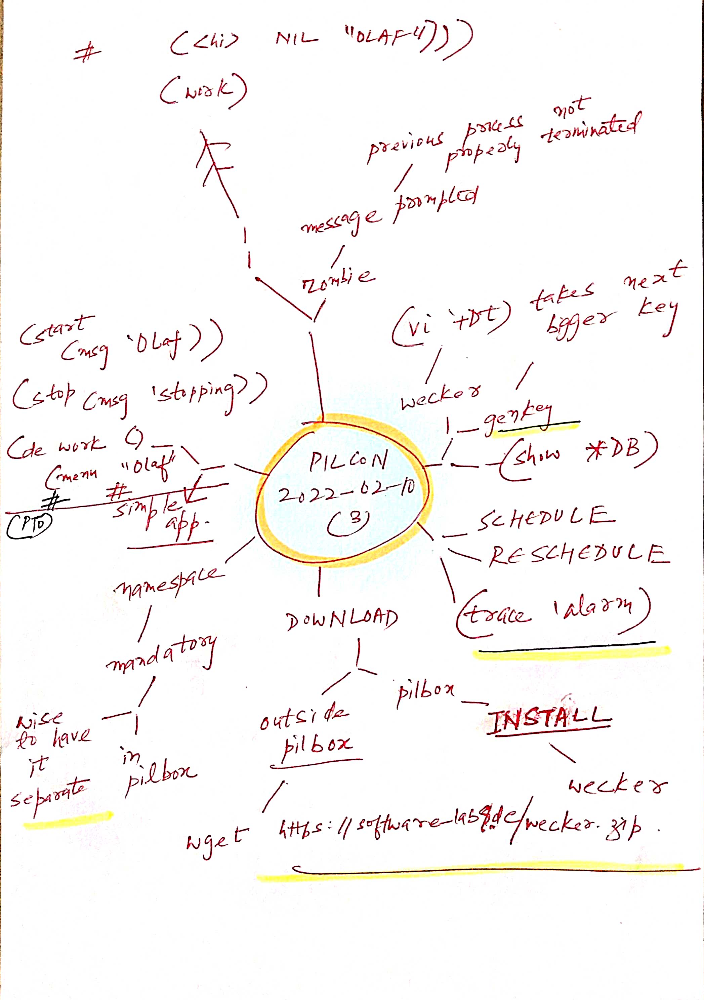
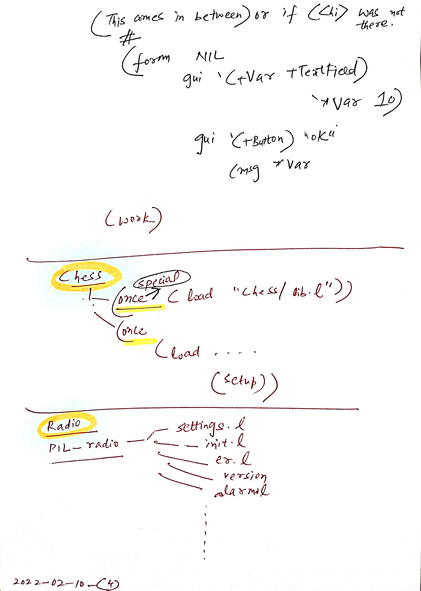
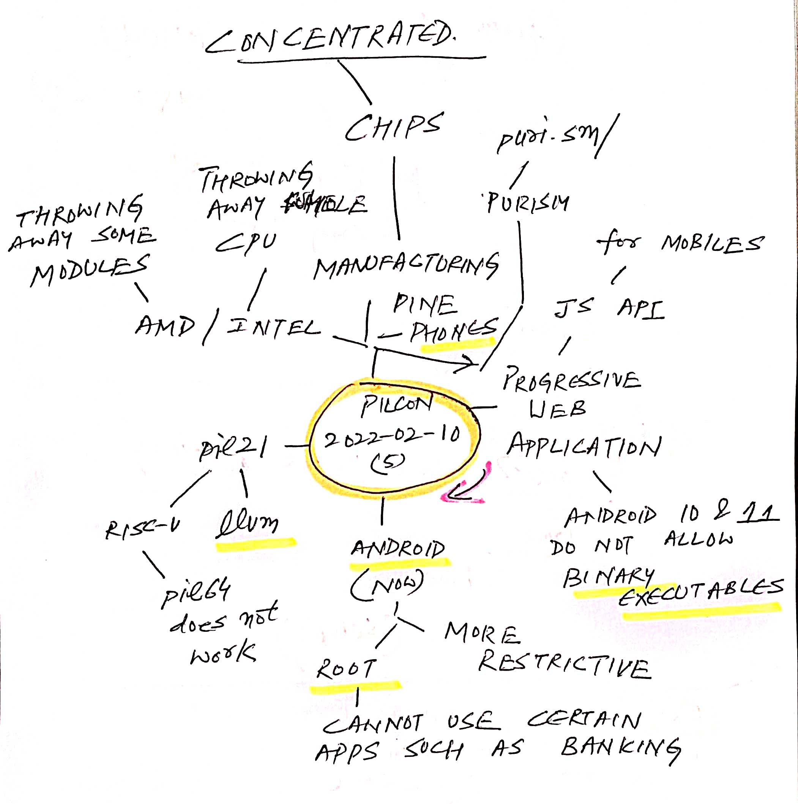
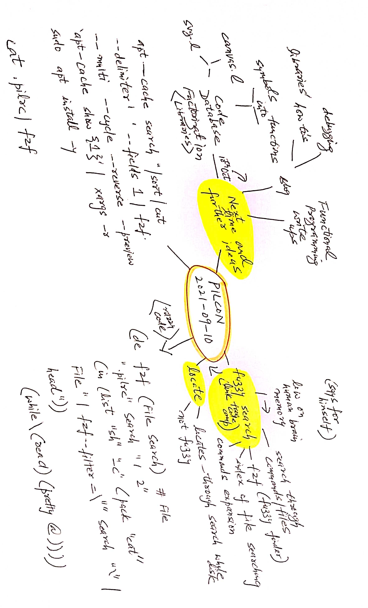
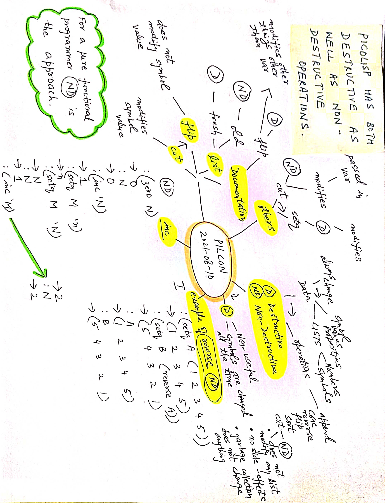

# PilCon

## PilCon 2022

Latest on top. 

### 2022-06-10

### 2022-04-10

### 2022-03-10

### 2022-02-10

## PilCon 2021

### 2021-09-10

#### Links discussed/sources

- [Fuzzy Finder](https://www.freecodecamp.org/news/fzf-a-command-line-fuzzy-finder-missing-demo-a7de312403ff/)
- [Top Down Approach Mind Maps](https://github.com/NehalSinghal/picolisp/blob/main/Piltopdownapproach-2021-09-10.pdf)
- [Blog structure](https://gitlab.com/picolisp-blog/structure)
- [HTTP made easy](https://jmarshall.com/easy/http/)

### 2021-08-10

